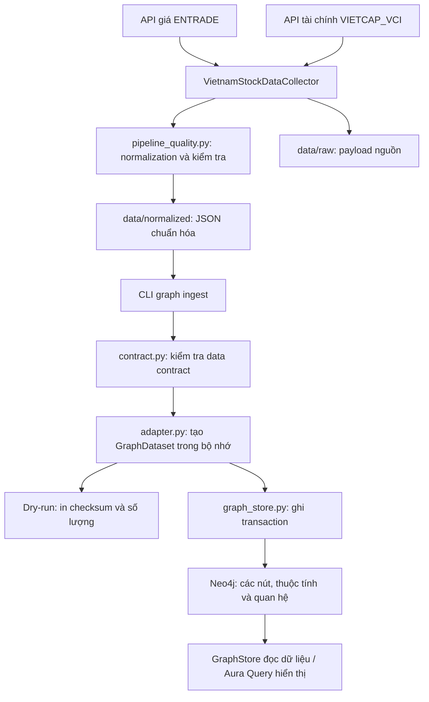
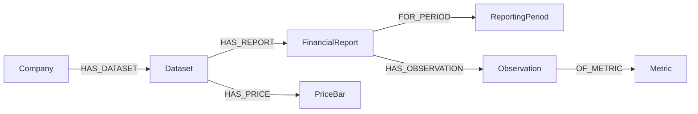

# FinMind: từ dữ liệu nguồn đến Knowledge Graph

Tài liệu này diễn giải cách code hiện tại thu thập dữ liệu chứng khoán, chuẩn hóa thành JSON và chuyển JSON thành graph trong Neo4j. Nội dung được đối chiếu với code trên branch `nhan` ngày 18/09/2026.

Crawler và normalization được giữ nguyên từ công việc trên branch `quan`. Phần graph nằm trong `backend/src/graph`. Đây là thư viện Python và CLI; hiện chưa có HTTP API hoặc giao diện FinMind để gọi các hàm graph.

## 1. Bức tranh tổng thể



Có hai quy trình chạy riêng:

1. **Data pipeline:** gọi API, chuẩn hóa và xuất file JSON.
2. **Graph ingestion:** đọc file normalized đã có và ghi vào Neo4j.

Crawler hiện không tự gọi graph ingestion. Việc tạo instance Neo4j, nạp dữ liệu và mở Aura Query là các thao tác riêng. Graph ingestion không cần gọi lại API nguồn.

## 2. Các file và trách nhiệm

| File | Trách nhiệm |
| --- | --- |
| [`direct_vn_collector.py`](../data_pipeline/src/scrapers/direct_vn_collector.py) | Gọi API giá và tài chính, điều phối normalization, xuất raw và normalized |
| [`pipeline_quality.py`](../data_pipeline/src/pipeline_quality.py) | Chuẩn hóa giá, kỳ báo cáo, xử lý dữ liệu không hữu hạn, ghi JSON |
| [`data_pipeline/src/ingest.py`](../data_pipeline/src/ingest.py) | Hiện là file trống; không phải điểm vào đang thu thập dữ liệu |
| [`contract.py`](../backend/src/graph/contract.py) | Đọc JSON nghiêm ngặt, kiểm tra dữ liệu, định nghĩa `GraphDataset` |
| [`adapter.py`](../backend/src/graph/adapter.py) | Chuyển payload normalized thành các bản ghi graph |
| [`graph_store.py`](../backend/src/graph/graph_store.py) | Kết nối, tạo schema, ghi transaction và đọc dữ liệu Neo4j |
| [`backend/src/graph/ingest.py`](../backend/src/graph/ingest.py) | CLI điều phối kiểm tra, dry-run và ingestion |
| [`init_neo4j_graph.cypher`](../backend/scripts/init_neo4j_graph.cypher) | Khai báo bảy ràng buộc duy nhất cho các loại nút |
| [`knowledge_graph_contract.md`](knowledge_graph_contract.md) | Đặc tả kỹ thuật của data contract và mô hình graph |

## 3. Thu thập dữ liệu từ nguồn

Class `VietnamStockDataCollector` hiện có danh sách mặc định: `FPT`, `VNM`, `HPG`, `VCB`, `MWG`, `VIC`, `TCB`, `SSI`.

Với từng mã, `process_stock()` lần lượt thu thập:

| Nhóm | Hàm | Nguồn / endpoint được code sử dụng |
| --- | --- | --- |
| Giá ngày OHLCV | `fetch_prices()` | ENTRADE: `https://services.entrade.com.vn/chart-api/v2/ohlcs/stock` |
| Tỷ số tài chính | `fetch_financial_ratios()` | VIETCAP: `/company/{symbol}/statistics-financial` |
| Kết quả kinh doanh | `fetch_statement_section()` | VIETCAP: `/company/{symbol}/financial-statement?section=INCOME_STATEMENT` |
| Bảng cân đối kế toán | `fetch_statement_section()` | VIETCAP: cùng endpoint, `section=BALANCE_SHEET` |
| Lưu chuyển tiền tệ | `fetch_statement_section()` | VIETCAP: cùng endpoint, `section=CASH_FLOW` |

Base URL tài chính là `https://iq.vietcap.com.vn/api/iq-insight-service/v1`.

Code yêu cầu giá ngày từ đầu năm 2018 đến thời điểm chạy. Mỗi lần gọi có timeout 20 giây và tối đa ba lần thử theo mặc định. Báo cáo tài chính gộp dữ liệu quý và năm mà nguồn trả về.

Nếu thiếu giá hoặc bất kỳ nhóm tài chính nào, collector không publish bộ dữ liệu mới của mã đó. Các file tốt đã có được giữ lại. Đây là cơ chế tránh thay một bộ dữ liệu đầy đủ bằng bộ thiếu dữ liệu.

## 4. Normalization: từ payload API thành JSON sử dụng được

### 4.1. Giá ngày

API giá trả về các mảng song song `t`, `o`, `h`, `l`, `c`, `v`. `normalize_price_payload()` kiểm tra các mảng có cùng độ dài rồi ghép các phần tử cùng vị trí thành một phiên giao dịch.

| Trường API | Trường normalized |
| --- | --- |
| `t` | `source_timestamp` và `date` |
| `o` | `open` |
| `h` | `high` |
| `l` | `low` |
| `c` | `close` |
| `v` | `volume` |

Ngày giao dịch được tính từ timestamp theo múi giờ `Asia/Ho_Chi_Minh`.

Các bước xử lý chính:

1. Chuyển `NaN` và Infinity thành `null` để JSON hợp lệ.
2. Khi trùng ngày, giữ bản ghi có timestamp nguồn lớn nhất; ghi nhận quality issue.
3. Loại bản ghi có giá không hợp lệ hoặc volume không hợp lệ khỏi output normalized.
4. Chuyển volume hợp lệ thành số nguyên, sắp xếp giá theo ngày tăng dần.
5. Nếu không còn phiên hợp lệ, báo lỗi thay vì publish.

Các vấn đề của nguồn được ghi trong `quality.issues`. `rejected_price_records` là số bản ghi đầu vào không được giữ trong output, bao gồm cả bản ghi trùng bị loại.

### 4.2. Báo cáo tài chính

`normalize_financial_rows()` bổ sung khóa kỳ báo cáo:

```json
{
  "period_label": "2023-Q3",
  "period_type": "QUARTER",
  "year": 2023,
  "quarter": 3
}
```

Kỳ năm dùng `2023-YEAR`, `period_type: YEAR` và quarter chuẩn là `null`. Code giữ lại các trường nhà cung cấp bằng `item.update(...)`; vì vậy trường nguồn có thể ghi đè `year` hoặc `quarter`. Ví dụ ratios có thể giữ `year` dạng chuỗi hoặc `quarter: 5` cho kỳ năm. Graph adapter xử lý các biến thể này mà không sửa file normalized.

Không cho phép hai dòng cùng kỳ trong một nhóm báo cáo. Các dòng được sắp xếp theo kỳ giảm dần. Các giá trị không hữu hạn được chuyển thành `null`; các giá trị hợp lệ không bị làm tròn.

### 4.3. Xuất raw và normalized

Sau khi thu thập đủ các nhóm, collector tạo cùng một `dataset_version` theo UTC cho cả hai file:

```text
data/raw/FPT_raw.json
data/normalized/FPT.json
```

Normalized có các thành phần chính:

```text
schema_version
dataset_version
symbol
generated_at
sources
quality
meta
price_history[]
financial_data
    ratios[]
    income_statement[]
    balance_sheet[]
    cash_flow_statement[]
```

`atomic_write_json()` ghi qua file tạm, flush/fsync rồi thay file đích. Tính atomic áp dụng cho **từng file**. Hai lần ghi raw và normalized không nằm trong một transaction chung; nếu lần thứ hai lỗi, raw có thể đã được thay mới trong khi normalized vẫn là bản cũ.

File mỗi mã được thay thế khi có lần publish mới. Graph giữ lịch sử phiên bản đã nạp, nhưng thư mục normalized hiện không tự lưu toàn bộ lịch sử file.

## 5. Data contract: cửa kiểm tra trước graph

`contract.load_dataset()` đọc tối đa 32 MiB, từ chối khóa JSON trùng, JSON lỗi và số không hữu hạn. `validate_dataset()` kiểm tra toàn bộ snapshot.

Các điều kiện quan trọng:

- `schema_version` là `1.0`.
- Symbol là mã viết hoa đúng định dạng.
- `dataset_version` dạng `YYYYMMDDTHHMMSSZ`, khớp giây UTC của `generated_at`.
- Có mã nguồn cho prices và fundamentals.
- Có giá và đủ bốn nhóm tài chính; các nhóm đều không rỗng.
- Kỳ báo cáo đúng định dạng, khớp year/quarter và không trùng trong cùng section.
- Giá có ngày duy nhất, tăng dần, OHLC dương và hợp lệ; timestamp khớp ngày UTC+7.
- Volume là số nguyên không âm hoặc `null`.
- Số lượng, khoảng ngày trong `meta` và số lượng trong `quality` khớp dữ liệu.
- JSON có độ sâu tối đa 128 tầng.

`PASS_WITH_WARNINGS` được chấp nhận nếu cấu trúc và dữ liệu đã publish hợp lệ. Một quality issue severity `ERROR` có thể mô tả bản ghi nguồn đã bị loại; nó không tự động làm toàn bộ normalized bị từ chối.

Contract kiểm tra tính hợp lệ và nhất quán của dữ liệu. Nó không xác minh tính chính xác nghiệp vụ của số liệu, cũng không tự diễn giải mọi mã chỉ tiêu của nhà cung cấp.

## 6. Adapter: tạo graph trong bộ nhớ

`adapter.to_graph(payload, source_file=...)` kiểm tra payload rồi trả về `GraphDataset` gồm:

```python
company
dataset
periods
reports
metrics
observations
prices
```

Các trường trên là dictionary hoặc tuple chứa dictionary để chuẩn bị truyền cho Neo4j. Giai đoạn này chưa ghi database và không thay đổi payload đầu vào.

### 6.1. Bảy loại nút

| Nhãn Neo4j | Đại diện cho | Khóa duy nhất |
| --- | --- | --- |
| `Company` | Mã cổ phiếu | `symbol` |
| `Dataset` | Một snapshot của một mã | `symbol:dataset_version` |
| `ReportingPeriod` | Một kỳ quý hoặc năm | `period_label` |
| `FinancialReport` | Một section tại một kỳ của snapshot | `dataset_id:section:period_label` |
| `Metric` | Một mã chỉ tiêu của nguồn | `source:section:code` |
| `Observation` | Giá trị của chỉ tiêu trong một báo cáo | `report_id:code` |
| `PriceBar` | Giá một ngày trong snapshot | `dataset_id:date` |

Company, ReportingPeriod và Metric có thể được dùng chung giữa các snapshot. Report, Observation và PriceBar thuộc snapshot cụ thể. ReportingPeriod chỉ xác định kỳ lịch; `basis` của báo cáo vẫn cần được xem riêng để hiểu cơ sở tính.

### 6.2. Các quan hệ



Ví dụ một đường đi: **FPT → snapshot → báo cáo ratios quý 3/2023 → giá trị của một chỉ tiêu → mã chỉ tiêu đó**.

### 6.3. Ví dụ chuyển một dòng báo cáo

Ví dụ minh họa, rút gọn từ cấu trúc input; số `0.144` dưới đây không phải khẳng định số liệu thực tế:

```json
{
  "period_label": "2023-Q3",
  "period_type": "QUARTER",
  "year": "2023",
  "quarter": 3,
  "ratioType": "RATIO_TTM",
  "afterTaxProfitMargin": 0.144
}
```

Với snapshot `FPT:20260915T093340Z`, adapter tạo:

```text
ReportingPeriod.id = 2023-Q3
FinancialReport.id = FPT:20260915T093340Z:ratios:2023-Q3
FinancialReport.basis = RATIO_TTM
Metric.id = VIETCAP_VCI:ratios:afterTaxProfitMargin
Observation.id = FPT:20260915T093340Z:ratios:2023-Q3:afterTaxProfitMargin
Observation.value = 0.144
Observation.value_json = "0.144"
```

`REPORT_METADATA` xác định các trường như year, quarter, ticker, ngày nguồn và ratioType là metadata, không tạo Observation cho chúng. Các trường còn lại trở thành Observation, kể cả `null` hoặc giá trị JSON dạng mảng/object.

`Metric` xác định chỉ tiêu; `Observation` là giá trị cụ thể. Các quý khác nhau có Observation khác nhau và có thể cùng nối đến một Metric.

### 6.4. Bảo toàn dữ liệu và đơn vị

- Dataset lưu toàn bộ payload normalized trong `payload_json`.
- FinancialReport và PriceBar lưu JSON của dòng gốc.
- Observation luôn lưu `value_json`, `value_type` và `is_null`.
- Giá trị số phù hợp được lưu thêm vào thuộc tính `value` để tiện truy vấn.
- Số nguyên ngoài phạm vi signed 64-bit chỉ được giữ trong JSON, không gửi như thuộc tính số Neo4j.
- Giá trị `null` vẫn có Observation với `is_null: true`; Neo4j không giữ thuộc tính có giá trị null.
- Số 0, số âm và giá trị hợp lệ được giữ nguyên.
- Metric có `unit_status: UNKNOWN`; code chưa tự gán tiền tệ, tỷ lệ, hệ số hay đơn vị cho mã nguồn.
- `ratioType` được giữ làm `basis`. Báo cáo mang nhãn quý nhưng `RATIO_TTM` có cơ sở 12 tháng gần nhất; không được mặc định coi là số liệu chỉ riêng quý.

### 6.5. Provenance: truy ngược về JSON

Báo cáo lưu source, source_file và json_pointer. Observation có json_pointer tới trường cụ thể:

```text
source_file: .../data/normalized/FPT.json
report.json_pointer: /financial_data/ratios/14
observation.json_pointer: /financial_data/ratios/14/afterTaxProfitMargin
```

Pointer cho biết giá trị nằm ở đâu trong snapshot gốc. Dataset ID và checksum giúp xác định đúng snapshot, vì file cùng tên có thể được crawler thay thế ở lần chạy sau. Các ký tự đặc biệt trong tên trường được escape theo JSON Pointer.

## 7. Kết nối Neo4j và quản lý credentials

`GraphStore.from_environment()` đọc cấu hình từ môi trường của process; nếu thiếu thì lấy từ `.env` ở thư mục gốc repo:

| Biến | Công dụng |
| --- | --- |
| `NEO4J_URI` | URI kết nối, ví dụ `neo4j+s://<host>.databases.neo4j.io` |
| `NEO4J_USER` | Username database |
| `NEO4J_PASSWORD` | Mật khẩu database |
| `NEO4J_DATABASE` | Database đích; mặc định `neo4j` nếu không khai báo |

Code ưu tiên `NEO4J_USER` và chấp nhận `NEO4J_USERNAME` như tên thay thế. Trong cùng nguồn cấu hình, `NEO4J_USER` được ưu tiên; cấu hình trong terminal luôn được ưu tiên hơn file. Username và database phải lấy theo credentials của instance, không suy ra từ instance ID. `AURA_INSTANCEID` và `AURA_INSTANCENAME` không được thư viện sử dụng.

Code tự đọc `.env` ở gốc repo bằng `python-dotenv`, chỉ nạp các biến kết nối Neo4j và tắt nội suy để giữ mật khẩu nguyên văn. Không tìm file `.env` theo thư mục terminal và không tự đọc `backend/.env`. Nếu không có file thì vẫn dùng được biến môi trường. Dry-run không đọc `.env`.

Code không ghi credentials xuống file và không nhận mật khẩu qua CLI. Nó tạo official Neo4j driver, kiểm tra connectivity rồi dùng session với database đã cấu hình. Context manager `with` đóng driver khi kết thúc.

Điền cấu hình một lần vào `.env` theo mẫu [`.env.example`](../.env.example):

```dotenv
NEO4J_URI=neo4j+s://YOUR_HOST.databases.neo4j.io
NEO4J_USER=YOUR_DATABASE_USERNAME
NEO4J_PASSWORD='YOUR_NEW_DATABASE_PASSWORD'
NEO4J_DATABASE=YOUR_DATABASE_NAME
```

Thay các placeholder bằng thông tin hiện tại trong credentials Aura. `.env` được ignore và không theo dõi trong Git; `.env.example` chỉ chứa mẫu. Nếu sửa file mà terminal vẫn còn biến cấu hình cũ, mở terminal mới để file có hiệu lực.

CLI che nội dung lỗi driver bằng thông báo chung để tránh đưa cấu hình kết nối vào output. Không ghi mật khẩu thực vào tài liệu hoặc commit.

## 8. Ghi graph: schema, claim và transaction

### 8.1. Tạo schema

`ensure_schema()` chạy bảy `CREATE CONSTRAINT ... IF NOT EXISTS` trong file Cypher. Mỗi loại nút có một khóa duy nhất. Việc tạo schema diễn ra trước transaction dữ liệu và không bị rollback cùng dataset.

### 8.2. Thứ tự ghi một snapshot

`GraphStore.ingest()` gọi adapter, bảo đảm schema rồi gọi `session.execute_write()` với `_write()`.

Trong transaction, code thực hiện:

1. `MERGE` Dataset theo ID. Nếu mới tạo, ghi checksum, graph_version, status `IMPORTING` và claim_token ngẫu nhiên.
2. So sánh checksum và graph_version để phát hiện xung đột.
3. Nếu dataset đã `COMPLETE` và khớp nội dung, trả `created: false` mà không ghi lại các nút.
4. Với dataset mới, lưu thuộc tính Dataset và nối Company bằng `HAS_DATASET`.
5. Ghi ReportingPeriod và Metric trước.
6. Ghi FinancialReport, nối Dataset và ReportingPeriod.
7. Ghi Observation, nối FinancialReport và Metric.
8. Ghi PriceBar và nối Dataset.
9. Đặt Dataset `COMPLETE`, bỏ claim_token.
10. Commit transaction và trả `created: true`.

Claim token là dấu hiệu nội bộ cho transaction đang tạo dataset; không phải token đăng nhập. Unique constraint và claim trong cùng transaction được thiết kế để xử lý các lần tạo đồng thời.

### 8.3. Batch không phải transaction riêng

Các nhóm được gửi qua `UNWIND $rows`, mặc định tối đa 1.000 bản ghi mỗi lần. Mọi batch của một dataset vẫn dùng chung transaction.

Nếu bước ghi lỗi, transaction rollback claim và thay đổi dữ liệu của lần nạp đó. `IMPORTING` là trạng thái bên trong transaction; không phải checkpoint đã commit để tiếp tục một lần nạp bị ngắt.

Khi nạp cả thư mục, mỗi dataset có transaction riêng. Nếu mã thứ hai lỗi, mã thứ nhất đã commit vẫn còn trong database.

## 9. Phiên bản, checksum và nạp lặp

Adapter serialize payload bằng canonical JSON: sắp xếp khóa object, bỏ khoảng trắng thừa, giữ thứ tự array và từ chối số không hữu hạn. SHA-256 của chuỗi này là checksum.

Thay đổi thứ tự khóa object, khoảng trắng hoặc đường dẫn file không làm checksum đổi. Thay đổi nội dung hoặc thứ tự phần tử array có thể làm checksum đổi.

| Trường hợp | Kết quả |
| --- | --- |
| Dataset ID chưa có | Tạo snapshot mới, `created: true` |
| Cùng ID, checksum và graph_version; đã COMPLETE | Không ghi lại, `created: false` |
| Cùng ID nhưng checksum hoặc graph_version khác | `DatasetConflictError` |
| Cùng mã nhưng dataset_version mới | Lưu snapshot mới, giữ snapshot cũ |

Không sửa nội dung rồi dùng lại cùng dataset_version. Một phiên bản xác định một snapshot bất biến theo contract.

Mỗi snapshot chứa cả lịch sử giá và báo cáo mà file normalized mang theo. Nạp nhiều snapshot có thể lặp lại dữ liệu lịch sử giữa các snapshot; đây là lựa chọn giữ nguyên từng bộ dữ liệu, không phải mô hình chỉ lưu phần thay đổi.

## 10. CLI: từ lệnh tới kết quả

### 10.1. Dry-run một mã

Chạy từ thư mục gốc repo:

```powershell
python -B -m backend.src.graph.ingest --dry-run --input data/normalized/FPT.json
```

CLI đọc file, kiểm tra và chuyển thành graph trong bộ nhớ. Không cần driver, credentials hay server Neo4j.

Kết quả FPT đã quan sát trong phiên này:

```json
{
  "dataset_id": "FPT:20260915T093340Z",
  "checksum": "71fa525d3d4a3e75e6f2ad4596a28fc43de877fe8e7181560ce821c017cf776a",
  "dry_run": true,
  "counts": {
    "periods": 42,
    "reports": 167,
    "metrics": 790,
    "observations": 33127,
    "prices": 2167
  }
}
```

`counts` không bao gồm Company và Dataset. Đây là số lượng bản ghi adapter tạo cho snapshot, không phải số nút mới được tạo trong toàn database; một số nút có thể đã được dùng chung.

### 10.2. Nạp thật

Sau khi đã điền `.env` ở gốc repo (hoặc cấu hình biến môi trường) và cài dependency từ `backend/requirements.txt`:

```powershell
python -B -m backend.src.graph.ingest --input data/normalized/FPT.json
```

Output có `dataset_id`, `created` và `counts`. Nếu lỗi đầu vào, cấu hình hay Neo4j, CLI trả exit code 1; thành công trả 0.

### 10.3. Nạp thư mục

```powershell
python -B -m backend.src.graph.ingest --dry-run
```

Mặc định input là thư mục `data/normalized` được xác định theo vị trí repo. CLI lấy các file `*.json`, sắp xếp đường dẫn, kiểm tra tất cả và từ chối dataset identity trùng trước khi kết nối.

Bỏ `--dry-run` sẽ nạp toàn bộ thư mục. Cần bảo đảm dung lượng instance trước khi chạy: lần thử hiện tại dùng FPT; toàn bộ tám mã vượt quota của instance AuraDB Free đang dùng.

## 11. Đọc dữ liệu từ backend

### 11.1. Lấy lại snapshot

```python
from backend.src.graph.graph_store import GraphStore

with GraphStore.from_environment() as store:
    payload = store.get_dataset("FPT")
```

`get_dataset()` chọn dataset `COMPLETE` mới nhất theo dataset_version, đọc `payload_json` và parse lại thành dictionary. Không có dataset phù hợp thì trả `None`.

Có thể chỉ định `dataset_version="20260915T093340Z"` để đọc đúng phiên bản.

### 11.2. Lấy giá trị của chỉ tiêu

```python
with GraphStore.from_environment() as store:
    rows = store.get_observations(
        symbol="FPT",
        period_label="2023-Q3",
        section="ratios",
        code="afterTaxProfitMargin",
        dataset_version="20260915T093340Z",
        limit=100,
        offset=0,
    )
```

Hàm chọn đúng một snapshot COMPLETE rồi tìm report và observation trong snapshot đó. Kết quả chứa giá trị đã parse từ `value_json`, code, unit_status, basis, source, source_file, json_pointer, dataset ID/version và checksum.

Không truyền code thì lấy các chỉ tiêu của section/kỳ. Không truyền dataset_version thì chọn snapshot COMPLETE mới nhất. Limit được giới hạn 1–1.000, offset không âm. Code dùng Cypher có tham số để truyền giá trị truy vấn.

Hiện chưa có hàm Python chuyên đọc lịch sử PriceBar hoặc HTTP endpoint; PriceBar vẫn có thể truy vấn trực tiếp bằng Cypher.

## 12. Hiểu và kiểm tra graph trên Aura Query

### 12.1. Kiểm tra dataset

```cypher
MATCH (d:Dataset {id: 'FPT:20260915T093340Z'})
RETURN d.id, d.status, d.checksum;
```

Status mong đợi là `COMPLETE`.

### 12.2. Xem company, dataset và các báo cáo

```cypher
MATCH p = (:Company {symbol: 'FPT'})
          -[:HAS_DATASET]->(d:Dataset {id: 'FPT:20260915T093340Z'})
          -[:HAS_REPORT]->(:FinancialReport)
RETURN p
LIMIT 20;
```

Dataset nối tới nhiều báo cáo nên hình thường có dạng một chùm nút. `LIMIT 20` giới hạn số đường đi trả về, không phải tổng số nút trong database.

Graph view là cách Aura bố trí kết quả truy vấn. Khoảng cách, hướng bố trí và kích thước trên màn hình không thể hiện biến động giá hay độ lớn của số liệu. Màu sắc phụ thuộc cách hiển thị; cần bấm nút xem label và thuộc tính để xác định nó.

### 12.3. Xem một báo cáo và năm chỉ tiêu

```cypher
MATCH (:Company {symbol: 'FPT'})
      -[:HAS_DATASET]->(d:Dataset {id: 'FPT:20260915T093340Z'})
      -[:HAS_REPORT]->(r:FinancialReport {
        section: 'ratios',
        period_label: '2023-Q3'
      })
MATCH p = (r)-[:HAS_OBSERVATION]->(:Observation)-[:OF_METRIC]->(:Metric)
RETURN p
LIMIT 5;
```

Đường đi lúc này là báo cáo → giá trị → chỉ tiêu, giúp hiểu mô hình mà không mở quá nhiều nút cùng lúc.

### 12.4. Đọc số liệu ở dạng bảng

```cypher
MATCH (d:Dataset {id: 'FPT:20260915T093340Z'})
      -[:HAS_REPORT]->(r:FinancialReport {
        section: 'ratios',
        period_label: '2023-Q3'
      })
MATCH (r)-[:HAS_OBSERVATION]->(o:Observation)-[:OF_METRIC]->(m:Metric)
RETURN m.code AS code,
       o.value_json AS value_json,
       m.unit_status AS unit_status,
       r.basis AS basis,
       r.source AS source,
       o.json_pointer AS json_pointer
ORDER BY code
LIMIT 20;
```

Chọn tab Table để đọc. Dùng `value_json` ở đây giúp nhìn cả giá trị null hoặc không phải số. Graph phù hợp khám phá quan hệ; bảng phù hợp đọc số liệu.

## 13. Những gì đã được kiểm chứng và giới hạn hiện tại

Theo kết quả kiểm tra đã ghi nhận trước khi thử Aura:

- 24 graph unit tests đã pass, gồm contract, adapter, CLI và hành vi ở biên driver dùng mock.
- Dry-run đã kiểm tra cả tám mã: 17.232 bản ghi giá và 1.335 báo cáo.
- Auditor của pipeline đã pass cả tám mã với 394.932 ô dữ liệu được kiểm tra.

Trong phiên thử Aura, người dùng đã xác nhận:

- Instance AuraDB Free đang chạy.
- Dry-run FPT trả đúng các counts bên trên.
- Nạp FPT thật và truy vấn thấy Dataset `COMPLETE`.
- Graph view hiển thị các báo cáo và thuộc tính từ dữ liệu đã nạp.

Các xác nhận trên cho thấy đường đi FPT từ normalized tới graph đã chạy trên server Aura. Ở giai đoạn thử Aura chưa có xác nhận về rollback khi cố ý gây lỗi, ingestion đồng thời hoặc chạy lặp `created: false`. Mock tests không thay thế các kiểm chứng đó.

Sau đó, kiểm chứng trực tiếp trên Neo4j Community `2026.08.1` trong Docker local ngày 18/09/2026 đã thành công: nạp FPT trả `created: true`, nạp lại trả `created: false`, dataset COMPLETE, đọc lại toàn bộ payload khớp input và đọc được observation của một chỉ tiêu. Database local có 36.295 nodes và 68.756 relationships; HTTP Browser trả status 200. Cả 29 graph tests pass. Rollback khi cố ý gây lỗi và ingestion đồng thời vẫn chưa được kiểm chứng trên server thật.

Hiện cũng chưa có lịch chạy tự động từ crawler tới graph, lớp HTTP API, từ điển diễn giải/đơn vị đầy đủ cho mã chỉ tiêu, thuật toán graph analytics hay giao diện trực quan riêng của FinMind. Các quan hệ đang được tạo theo quy tắc adapter đã định nghĩa; code không dùng AI để tự suy ra quan hệ.

## 14. Chạy Neo4j Community local bằng Docker

Repo có [docker-compose.yml](../docker-compose.yml) chạy image Community `neo4j:2026.08.1`. Cấu hình chỉ mở cổng trên localhost và có named volume `neo4j_data` gắn vào `/data`. Volume được giữ khi dừng hoặc tạo lại container thông thường.

Điền `.env` ở gốc repo cho database local:

```dotenv
NEO4J_URI=bolt://localhost:7687
NEO4J_USER=neo4j
NEO4J_PASSWORD='YOUR_LOCAL_PASSWORD_AT_LEAST_8_CHARACTERS'
NEO4J_DATABASE=neo4j
```

Docker Compose đọc cùng file `.env` để đặt mật khẩu ban đầu bằng `NEO4J_AUTH`. Biến trong terminal được ưu tiên, nên mở terminal mới nếu trước đó đã cấu hình Aura qua `$env:...`. Mật khẩu local nên tách biệt với Aura. Đổi `NEO4J_AUTH` không đổi mật khẩu của database đã có trong volume; cần dùng chức năng đổi mật khẩu Neo4j khi database đã được tạo.

Chạy từ thư mục gốc repo khi Docker Desktop đang chạy:

```powershell
docker compose up -d --wait neo4j
docker compose ps
```

Lần đầu cần tải image. Healthcheck kiểm tra cổng Bolt đã mở; đây không phải kiểm tra authentication hoặc truy vấn dữ liệu.

Mở `http://localhost:7474`, dùng connection URL `bolt://localhost:7687`, username `neo4j` và mật khẩu trong `.env` để đăng nhập Neo4j Browser. Không cần tài khoản Aura để truy cập database local.

Sau đó nạp dữ liệu bằng môi trường Python đã cài dependency:

```powershell
python -B -m backend.src.graph.ingest --input data/normalized/FPT.json
```

Khi FPT chạy ổn và máy còn đủ tài nguyên, có thể nạp cả thư mục bằng lệnh không có `--input`. Community local không áp dụng quota nodes/relationships của AuraDB Free; dung lượng và tốc độ phụ thuộc tài nguyên máy. Cấu hình hiện giới hạn container 2 GiB, heap tối đa 768 MiB và page cache 256 MiB để bắt đầu trên máy 8 GB RAM; cần điều chỉnh theo tải thực tế.

Các lệnh quản lý:

```powershell
docker compose logs --tail 50 neo4j
docker compose stop neo4j
docker compose start neo4j
```

`docker compose down` xóa container/network nhưng giữ named volume. Không thêm `-v` nếu muốn giữ database, vì tùy chọn đó xóa volume của Compose. Database local và Aura độc lập; chuyển `.env` sang local không xóa hoặc chuyển dữ liệu Aura. Có thể nạp lại local từ normalized JSON.

Hướng dẫn image, mật khẩu và lưu dữ liệu: [Neo4j Docker Operations Manual](https://neo4j.com/docs/operations-manual/current/docker/introduction/).

## 15. Thứ tự đọc code để hiểu hệ thống

1. Đọc `process_stock()` trong collector để hiểu cách tạo snapshot.
2. Đọc `normalize_price_payload()` và `normalize_financial_rows()` để hiểu đầu ra normalized.
3. Mở một file trong `data/normalized` và đối chiếu schema.
4. Đọc `load_dataset()` và `validate_dataset()` để hiểu contract.
5. Đọc `to_graph()` để thấy từng trường được chuyển thành nút nào.
6. Đọc `GraphStore.ingest()` và `_write()` để hiểu cách ghi transaction.
7. Đọc `get_dataset()` và `get_observations()` để hiểu cách backend lấy dữ liệu.
8. Đọc `main()` của CLI để ghép các bước thành một lần chạy.

Đặc tả chi tiết về identity, tính bất biến và các quyết định thiết kế nằm trong [Knowledge Graph contract v1](knowledge_graph_contract.md).
