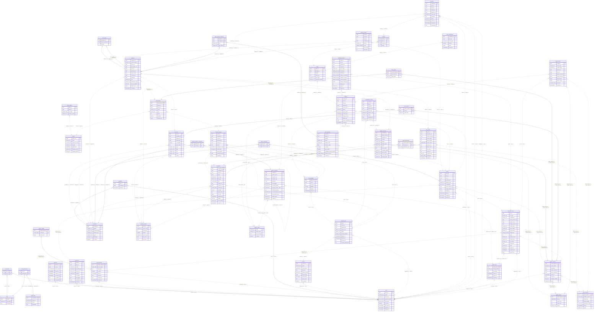

# Database ERD

Generated from the supplied schema. `PK` marks primary-key columns; relationships follow the declared references in the source.

```mermaid
erDiagram
  users {
    uuid user_id PK
    varchar_255_ email
    varchar_50_ username
    varchar_255_ password_hash
    varchar_255_ full_name
    boolean is_active
    timestamptz last_login_at
    timestamptz updated_at
    timestamptz created_at
  }
  user_roles {
    uuid user_id PK
    uuid role_id PK
  }
  sessions {
    uuid session_id PK
    uuid user_id
    varchar_128_ token_hash
    timestamptz issued_at
    timestamptz expires_at
    timestamptz revoked_at
    inet ip_address
    text user_agent
  }
  config_versions {
    uuid config_version_id PK
    varchar_30_ version_label
    text description
    boolean is_active
    timestamptz frozen_at
    uuid frozen_by
    uuid created_by
    timestamptz created_at
  }
  system_configs {
    uuid config_version_id PK
    varchar_100_ config_key PK
    jsonb config_value
  }
  roles {
    uuid role_id PK
    varchar_30_ role_code
    text description
  }
  permissions {
    uuid permission_id PK
    varchar_50_ resource
    varchar_30_ action
    text description
  }
  role_permissions {
    uuid role_id PK
    uuid permission_id PK
  }
  audit_logs {
    uuid audit_id PK
    uuid user_id
    varchar_50_ action
    varchar_50_ resource_type
    varchar_64_ resource_id
    varchar_20_ outcome
    inet ip_address
    text user_agent
    jsonb metadata_json
    timestamptz created_at
  }
  watchlists {
    uuid user_id PK
    uuid company_id PK
    timestamptz pinned_at
  }
  sources {
    uuid source_id PK
    varchar_100_ name
    varchar_30_ source_type
    text base_url
    varchar_20_ approval_status
    uuid approved_by
    timestamptz approved_at
    text scope_note
    boolean is_enabled
  }
  ingestion_jobs {
    uuid job_id PK
    uuid source_id
    uuid triggered_by
    varchar_20_ trigger_type
    varchar_20_ status
    varchar_20_ schema_version
    timestamptz started_at
    timestamptz finished_at
    int records_ok
    int records_quarantined
  }
  raw_payloads {
    uuid payload_id PK
    uuid job_id
    text source_uri
    char_64_ sha256
    jsonb payload
    timestamptz stored_at
  }
  quarantine_records {
    uuid record_id PK
    uuid job_id
    uuid payload_id
    uuid extraction_id
    varchar_30_ entity_type
    varchar_50_ reason_code
    varchar_20_ status
    uuid reviewed_by
    timestamptz reviewed_at
  }
  companies {
    uuid company_id PK
    varchar_10_ symbol
    varchar_255_ company_name
    varchar_30_ industry_type
    varchar_100_ sector
    varchar_10_ exchange
    boolean is_active
  }
  metrics {
    uuid metric_id PK
    varchar_50_ code
    varchar_255_ canonical_name
    varchar_30_ section
    varchar_20_ default_unit
    varchar_30_ industry_scope
    varchar_20_ mapping_status
  }
  financial_reports {
    uuid report_id PK
    uuid company_id
    uuid period_id
    uuid document_id
    uuid payload_id
    uuid job_id
    varchar_20_ statement_scope
    varchar_20_ audit_status
    int report_version
    uuid restated_from_id
    date published_at
  }
  reporting_periods {
    uuid period_id PK
    varchar_10_ period_code
    int fiscal_year
    smallint quarter
    varchar_10_ period_type
    date start_date
    date end_date
  }
  metric_aliases {
    uuid alias_id PK
    uuid metric_id
    varchar_255_ raw_label
    varchar_30_ industry_scope
  }
  price_bars {
    uuid price_id PK
    uuid company_id
    uuid payload_id
    date trade_date
    boolean is_adjusted
    int price_scale
    numeric_18_4_ open
    numeric_18_4_ high
    numeric_18_4_ low
    numeric_18_4_ close
    bigint volume
  }
  observations {
    uuid observation_id PK
    uuid report_id
    uuid metric_id
    numeric_24_4_ value
    varchar_20_ unit
    int scale
    char_3_ currency
    jsonb locator_json
  }
  documents {
    uuid document_id PK
    uuid company_id
    uuid period_id
    uuid job_id
    varchar_30_ doc_type
    varchar_10_ file_type
    varchar_500_ title
    text storage_uri
    text source_url
    varchar_100_ external_id
    char_2_ language
    int page_count
    bigint file_size
    timestamptz published_at
    char_64_ sha256
    varchar_20_ parse_status
    timestamptz created_at
  }
  text_chunks {
    uuid chunk_id PK
    uuid document_id
    uuid index_version_id
    int chunk_index
    int page_number
    varchar_255_ section_label
    text chunk_text
    int token_count
    int char_start
    int char_end
    char_64_ content_hash
    vector_1024_ embedding
    timestamptz created_at
  }
  index_versions {
    uuid index_version_id PK
    varchar_30_ chunker_version
    int chunk_size
    int chunk_overlap
    varchar_50_ embedding_model
    timestamptz built_at
    varchar_20_ status
  }
  evidence {
    uuid evidence_id PK
    varchar_10_ evidence_type
    uuid chunk_id
    uuid observation_id
    uuid price_id
    uuid extraction_id
    text calc_formula
    uuid company_id
    uuid period_id
    varchar_20_ unit
    varchar_20_ statement_scope
    char_64_ source_sha256
    jsonb locator_json
    timestamptz created_at
  }
  calc_inputs {
    uuid evidence_id PK
    uuid input_evidence_id PK
    int position
  }
  graph_versions {
    uuid graph_version_id PK
    timestamptz built_at
    int node_count
    int edge_count
    varchar_20_ status
  }
  graph_extractions {
    uuid extraction_id PK
    uuid graph_version_id
    uuid document_id
    varchar_10_ method
    varchar_255_ subject
    varchar_50_ relation_type
    varchar_255_ object
    text source_span
    varchar_20_ validation_status
    varchar_100_ reject_reason
    varchar_100_ neo4j_edge_key
    varchar_10_ manual_check
  }
  queries {
    uuid query_id PK
    uuid user_id
    uuid run_id
    text question_text
    varchar_20_ question_type
    varchar_10_ configuration
    uuid corpus_version_id
    uuid config_version_id
    char_2_ language
    varchar_64_ trace_id
    timestamptz created_at
    timestamptz deleted_at
  }
  reason_codes {
    varchar_50_ code PK
    varchar_20_ result_status
    text user_message
    boolean is_active
  }
  gate_decision_evidence {
    uuid decision_id PK
    uuid evidence_id PK
    varchar_10_ role
    varchar_50_ drop_reason
  }
  answers {
    uuid answer_id PK
    uuid query_id
    int attempt
    uuid decision_id
    text answer_text
    varchar_20_ status
    varchar_50_ reason_code
    varchar_50_ model_name
    varchar_30_ prompt_version
    int latency_ms
    jsonb latency_breakdown_json
    timestamptz created_at
  }
  claim_verifications {
    uuid verification_id PK
    uuid claim_id
    varchar_10_ check_type
    boolean passed
    jsonb detail
    timestamptz created_at
  }
  query_companies {
    uuid query_id PK
    uuid company_id PK
  }
  retrieval_results {
    uuid result_id PK
    uuid query_id
    int attempt
    uuid evidence_id
    varchar_10_ branch
    double_precision score
    int rank_before
    int rank_after
  }
  gate_decisions {
    uuid decision_id PK
    uuid query_id
    int attempt
    varchar_20_ status
    varchar_50_ reason_code
    date reference_date
    boolean is_stale
    boolean has_conflict
    boolean mandatory_branch_missing
    double_precision relevance_score
    timestamptz created_at
  }
  claims {
    uuid claim_id PK
    uuid answer_id
    int ordinal
    text claim_text
    varchar_10_ claim_type
    varchar_20_ verification_status
  }
  citations {
    uuid citation_id PK
    uuid claim_id
    uuid evidence_id
    int ordinal
  }
  feedback {
    uuid feedback_id PK
    uuid user_id
    uuid query_id
    uuid citation_id
    uuid evidence_id
    varchar_30_ issue_type
    text comment
    varchar_20_ status
    timestamptz created_at
    timestamptz resolved_at
    uuid resolved_by
  }
  corpus_versions {
    uuid corpus_version_id PK
    varchar_30_ version_label
    text description
    uuid graph_version_id
    uuid index_version_id
    timestamptz frozen_at
    uuid frozen_by
    char_64_ manifest_sha256
    varchar_20_ status
  }
  corpus_facts {
    uuid corpus_version_id PK
    uuid observation_id PK
    char_64_ value_hash
  }
  corpus_prices {
    uuid corpus_version_id PK
    uuid price_id PK
    char_64_ value_hash
  }
  evaluation_runs {
    uuid run_id PK
    varchar_12_ run_type
    varchar_10_ configuration
    uuid corpus_version_id
    uuid golden_set_id
    uuid config_version_id
    varchar_50_ model_name
    varchar_50_ judge_model
    varchar_20_ ragas_version
    double_precision temperature
    int seed
    varchar_30_ prompt_version
    varchar_64_ prompt_hash
    varchar_40_ git_commit
    jsonb config_json
    varchar_20_ status
    timestamptz started_at
    timestamptz completed_at
    uuid triggered_by
  }
  usage_events {
    uuid usage_id PK
    varchar_20_ event_type
    varchar_50_ model_name
    uuid answer_id
    uuid run_id
    uuid graph_version_id
    uuid index_version_id
    bigint tokens_input
    bigint tokens_output
    numeric_10_6_ cost_usd
    timestamptz recorded_at
  }
  corpus_documents {
    uuid corpus_version_id PK
    uuid document_id PK
    char_64_ document_hash
  }
  golden_sets {
    uuid golden_set_id PK
    varchar_20_ version_label
    text description
    timestamptz frozen_at
    uuid frozen_by
    timestamptz created_at
  }
  golden_questions {
    uuid question_id PK
    uuid golden_set_id
    text question_text
    varchar_20_ question_type
    uuid period_id
    varchar_20_ answerability
    varchar_20_ expected_status
    varchar_50_ expected_reason_code
    text reference_answer
    numeric_24_4_ canonical_numeric_value
    jsonb gold_locators_json
    varchar_10_ dataset_split
    timestamptz created_at
  }
  golden_question_companies {
    uuid question_id PK
    uuid company_id PK
  }
  evaluation_results {
    uuid result_id PK
    uuid run_id
    uuid question_id
    uuid answer_id
    varchar_20_ gate_status
    double_precision correctness
    double_precision faithfulness
    double_precision citation_correctness
    double_precision citation_coverage
    double_precision context_precision
    jsonb retrieval_recall_json
    int latency_ms
    varchar_64_ trace_id
    timestamptz created_at
  }
  user_roles }o--|| users : "user_id → user_id"
  user_roles }o--|| roles : "role_id → role_id"
  role_permissions }o--|| roles : "role_id → role_id"
  role_permissions }o--|| permissions : "permission_id → permission_id"
  sessions }o..|| users : "user_id → user_id"
  audit_logs }o..o| users : "user_id → user_id"
  config_versions }o..o| users : "frozen_by → user_id"
  config_versions }o..|| users : "created_by → user_id"
  system_configs }o--|| config_versions : "config_version_id → config_version_id"
  watchlists }o--|| users : "user_id → user_id"
  watchlists }o--|| companies : "company_id → company_id"
  sources }o..o| users : "approved_by → user_id"
  ingestion_jobs }o..|| sources : "source_id → source_id"
  ingestion_jobs }o..o| users : "triggered_by → user_id"
  raw_payloads }o..|| ingestion_jobs : "job_id → job_id"
  quarantine_records }o..o| ingestion_jobs : "job_id → job_id"
  quarantine_records }o..o| raw_payloads : "payload_id → payload_id"
  quarantine_records }o..o| graph_extractions : "extraction_id → extraction_id"
  quarantine_records }o..o| users : "reviewed_by → user_id"
  metric_aliases }o..|| metrics : "metric_id → metric_id"
  price_bars }o..|| companies : "company_id → company_id"
  price_bars }o..|| raw_payloads : "payload_id → payload_id"
  financial_reports }o..|| companies : "company_id → company_id"
  financial_reports }o..|| reporting_periods : "period_id → period_id"
  financial_reports }o..o| documents : "document_id → document_id"
  financial_reports }o..o| raw_payloads : "payload_id → payload_id"
  financial_reports }o..|| ingestion_jobs : "job_id → job_id"
  financial_reports }o..o| financial_reports : "restated_from_id → report_id"
  observations }o..|| financial_reports : "report_id → report_id"
  observations }o..|| metrics : "metric_id → metric_id"
  documents }o..o| companies : "company_id → company_id"
  documents }o..o| reporting_periods : "period_id → period_id"
  documents }o..|| ingestion_jobs : "job_id → job_id"
  text_chunks }o..|| documents : "document_id → document_id"
  text_chunks }o..|| index_versions : "index_version_id → index_version_id"
  evidence |o..o| text_chunks : "chunk_id → chunk_id"
  evidence |o..o| observations : "observation_id → observation_id"
  evidence |o..o| price_bars : "price_id → price_id"
  evidence |o..o| graph_extractions : "extraction_id → extraction_id"
  evidence }o..o| companies : "company_id → company_id"
  evidence }o..o| reporting_periods : "period_id → period_id"
  calc_inputs }o--|| evidence : "evidence_id → evidence_id"
  calc_inputs }o--|| evidence : "input_evidence_id → evidence_id"
  graph_extractions }o..|| graph_versions : "graph_version_id → graph_version_id"
  graph_extractions }o..|| documents : "document_id → document_id"
  queries }o..|| users : "user_id → user_id"
  queries }o..o| evaluation_runs : "run_id → run_id"
  queries }o..|| corpus_versions : "corpus_version_id → corpus_version_id"
  queries }o..|| config_versions : "config_version_id → config_version_id"
  query_companies }o--|| queries : "query_id → query_id"
  query_companies }o--|| companies : "company_id → company_id"
  retrieval_results }o..|| queries : "query_id → query_id"
  retrieval_results }o..|| evidence : "evidence_id → evidence_id"
  gate_decisions }o..|| queries : "query_id → query_id"
  gate_decisions }o..o| reason_codes : "reason_code → code"
  gate_decision_evidence }o--|| gate_decisions : "decision_id → decision_id"
  gate_decision_evidence }o--|| evidence : "evidence_id → evidence_id"
  answers }o..|| queries : "query_id → query_id"
  answers |o..o| gate_decisions : "decision_id → decision_id"
  answers }o..o| reason_codes : "reason_code → code"
  claims }o..|| answers : "answer_id → answer_id"
  citations }o..|| claims : "claim_id → claim_id"
  citations }o..|| evidence : "evidence_id → evidence_id"
  claim_verifications }o..|| claims : "claim_id → claim_id"
  feedback }o..|| users : "user_id → user_id"
  feedback }o..o| queries : "query_id → query_id"
  feedback }o..o| citations : "citation_id → citation_id"
  feedback }o..o| evidence : "evidence_id → evidence_id"
  feedback }o..o| users : "resolved_by → user_id"
  corpus_versions }o..o| graph_versions : "graph_version_id → graph_version_id"
  corpus_versions }o..o| index_versions : "index_version_id → index_version_id"
  corpus_versions }o..o| users : "frozen_by → user_id"
  corpus_documents }o--|| corpus_versions : "corpus_version_id → corpus_version_id"
  corpus_documents }o--|| documents : "document_id → document_id"
  corpus_facts }o--|| corpus_versions : "corpus_version_id → corpus_version_id"
  corpus_facts }o--|| observations : "observation_id → observation_id"
  corpus_prices }o--|| corpus_versions : "corpus_version_id → corpus_version_id"
  corpus_prices }o--|| price_bars : "price_id → price_id"
  golden_sets }o..o| users : "frozen_by → user_id"
  golden_questions }o..|| golden_sets : "golden_set_id → golden_set_id"
  golden_questions }o..o| reporting_periods : "period_id → period_id"
  golden_questions }o..o| reason_codes : "expected_reason_code → code"
  golden_question_companies }o--|| golden_questions : "question_id → question_id"
  golden_question_companies }o--|| companies : "company_id → company_id"
  evaluation_runs }o..|| corpus_versions : "corpus_version_id → corpus_version_id"
  evaluation_runs }o..|| golden_sets : "golden_set_id → golden_set_id"
  evaluation_runs }o..|| config_versions : "config_version_id → config_version_id"
  evaluation_runs }o..|| users : "triggered_by → user_id"
  evaluation_results }o..|| evaluation_runs : "run_id → run_id"
  evaluation_results }o..|| golden_questions : "question_id → question_id"
  evaluation_results }o..o| answers : "answer_id → answer_id"
  usage_events }o..o| answers : "answer_id → answer_id"
  usage_events }o..o| evaluation_runs : "run_id → run_id"
  usage_events }o..o| graph_versions : "graph_version_id → graph_version_id"
  usage_events }o..o| index_versions : "index_version_id → index_version_id"
```

